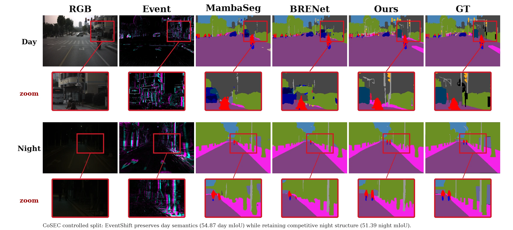

<div align="center">

# EventShift

**Reliability-Aware Residual Adaptation for Day–Night RGB–Event Semantic Segmentation**

Shao-Kai Liu<sup>1</sup> · Yun-Tze Tsai<sup>1</sup> · Chia-Yu Lin<sup>2</sup> · Chia-Ming Lee<sup>1,2</sup> · Chih-Chung Hsu<sup>1,2</sup>

<sup>1</sup> National Yang Ming Chiao Tung University · <sup>2</sup> National Cheng Kung University

[Project page](https://eventshift-seg.github.io/) · [Paper](https://eventshift-seg.github.io/assets/paper.pdf) · Code release pending

</div>



## Overview

EventShift keeps RGB features as the semantic anchor and lets event evidence contribute only through a reliability-aware, bounded residual correction. The correction is controlled at three levels:

- **When:** an illumination-conditioned budget opens more residual capacity as RGB visibility weakens.
- **Where:** density, temporal balance, polarity balance, support, and multi-window edges guide spatial allocation.
- **How much:** RMS normalization and clipping explicitly limit the correction relative to the RGB feature scale.

The adapter adds **0.47M parameters**, equivalent to **0.22%** of the 215.93M-parameter model.

## Key results

The primary evidence is the matched-backbone CoSEC19 ablation using the same Swin-L Mask2Former backbone, split, and training recipe.

| Method | Overall mIoU | Day mIoU | Night mIoU | Day–Night Avg. |
| --- | ---: | ---: | ---: | ---: |
| RGB continuation | 55.15 | 55.03 | 46.81 | 50.92 |
| **EventShift** | **55.10** | **54.87** | **51.39** | **53.13** |
| Change | −0.05 | −0.16 | **+4.58** | **+2.21** |

Additional evidence:

- **DSEC11:** 78.36 → **79.70 mIoU** and 95.33 → **95.73 pAcc** under the matched schedule.
- **Official challenge:** the separate composite challenge system placed **2nd** in the Test Phase with **41.11 mIoU**. Because the aggregate includes the REAL subset, this result is presented as context rather than a direct comparison with the controlled CoSEC-only experiment.

See the [interactive project page](https://eventshift-seg.github.io/#results) for the complete component table, visual comparisons, scope, and limitations.

## Repository contents

```text
.
├── index.html              # Responsive, dependency-free project page
├── assets/
│   ├── paper.pdf           # Final author version
│   ├── *.webp              # Optimized images served by the project page
│   ├── *.png               # Original-resolution source figures
│   └── paper.pdf           # Final author version
├── CITATION.cff            # Machine-readable citation metadata
├── LICENSE                 # MIT license for the project-page source code
└── .nojekyll               # Serve static assets directly on GitHub Pages
```

## Local preview

No build step or package installation is required.

```bash
git clone https://github.com/eventshift-seg/eventshift-seg.github.io.git
cd eventshift-seg.github.io
python3 -m http.server 8080
```

Open <http://localhost:8080>. Opening `index.html` directly also works, but a local server more closely matches GitHub Pages behavior.

## Citation

If you use this work, please cite:

```bibtex
@inproceedings{liu2026eventshift,
  title     = {EventShift: Reliability-Aware Residual Adaptation for Day--Night RGB--Event Semantic Segmentation},
  author    = {Liu, Shao-Kai and Tsai, Yun-Tze and Lin, Chia-Yu and Lee, Chia-Ming and Hsu, Chih-Chung},
  booktitle = {ECCV Workshop on Event-Based and Multimodal Vision (EBMV)},
  year      = {2026}
}
```

GitHub also exposes the same metadata through [`CITATION.cff`](CITATION.cff).

## Code availability

The research implementation is not included in this repository yet. This repository currently contains the project page, paper, and paper figures only.

## License

The project-page source code is released under the [MIT License](LICENSE). The paper PDF and paper figures remain copyright of their respective authors and are not covered by the software license.
